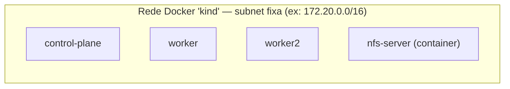
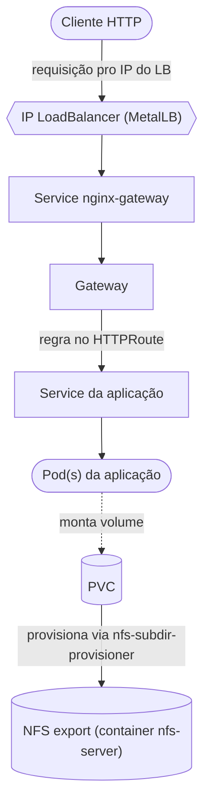

# KIND + MetalLB + Nginx + NFS

Homelab Kubernetes local: cluster KIND, LoadBalancer via MetalLB, exposição
HTTP via Gateway API (NGINX Gateway Fabric) e armazenamento compartilhado via
NFS.

## Arquitetura

### Topologia: tudo roda numa única rede Docker



Os 3 nodes do cluster KIND e o container do NFS são apenas containers Docker
na mesma rede — não tem VM, não tem cloud por trás. Por isso a subnet dessa
rede precisa ser fixa (seção 0): é o que garante que os IPs usados no resto
deste README continuem valendo depois de recriar o cluster.

### Fluxo: da requisição HTTP até o armazenamento



### Como o tráfego HTTP chega até a aplicação

1. **Cliente faz a requisição** para o IP de LoadBalancer do Service
   `nginx-gateway-nginx`. Esse IP não existe "de verdade" numa nuvem — é um
   IP dentro da própria rede Docker do KIND (`172.20.0.240-172.20.0.250`, o
   pool do MetalLB).
2. **MetalLB entra em dois papéis:**
   - o `controller` observa Services `type=LoadBalancer` sem IP e atribui um
     do pool (`IPAddressPool`);
   - o `speaker` (DaemonSet, um pod por node) responde as requisições ARP
     desse IP na rede Docker, fazendo o tráfego chegar até o node certo — é
     isso que substitui o "LoadBalancer de cloud" que o KIND não tem.
3. Uma vez que o pacote chega no node, o `kube-proxy` encaminha pro Pod do
   NGINX Gateway Fabric via Service normal do Kubernetes (ClusterIP por
   trás do LoadBalancer).
4. **Roteamento por host/path:** o NGINX Gateway Fabric lê o `Gateway`
   (a "porta" — protocolo, porta, quem pode anexar rotas) e os `HTTPRoute`
   anexados a ele (as regras de host/path propriamente ditas), decidindo
   pra qual Service de aplicação mandar.
5. O Service da aplicação distribui a requisição entre os Pods que
   respondem por ele (via `selector` de labels).

### Como o armazenamento compartilhado (NFS) funciona

1. Uma aplicação cria um `PersistentVolumeClaim` (PVC) pedindo
   `storageClassName: nfs-client`.
2. O `nfs-subdir-external-provisioner` (rodando como Deployment no
   cluster) observa esse PVC pendente e, por trás, monta o NFS export do
   container `nfs-server` (`nfs.server=172.20.0.5`, IP fixo graças à rede
   Docker pinada).
3. Ele cria uma **subpasta dedicada** dentro do export pra esse PVC
   específico, e gera um `PersistentVolume` (PV) apontando pra essa
   subpasta.
4. O PVC fica `Bound` a esse PV. Qualquer Pod que monte esse PVC — em
   qualquer node do cluster — passa a enxergar essa mesma pasta via NFS,
   o que dá armazenamento compartilhado real entre nodes (ao contrário do
   `hostPath` local do KIND, que não sai do node).

### Por que a rede Docker fixa importa pra tudo isso funcionar

Os IPs citados acima (`172.20.0.5` do NFS, `172.20.0.240-250` do pool do
MetalLB) só se repetem de execução em execução porque a rede Docker `kind`
é criada **manualmente, com subnet fixa, antes** do cluster e do container
NFS (seção 0 abaixo). Sem isso, o Docker sorteia a subnet toda vez que essa
rede não existe ainda, e todo IP fixo documentado aqui deixa de bater.

## Pré-requisitos KIND + MetalLB + NGINX + NFS

| Componente                            | Versão Recomendada      | Link Oficial                                                                 | Observações                                               |
|-------------------------------------|------------------------|-----------------------------------------------------------------------------|-----------------------------------------------------------|
| **Kind**                            | v0.20.0 ou superior    | [https://kind.sigs.k8s.io/](https://kind.sigs.k8s.io/)                      | Ferramenta para criar clusters Kubernetes locais.         |
| **kubectl**                        | v1.27.x ou superior     | [https://kubernetes.io/docs/tasks/tools/](https://kubernetes.io/docs/tasks/tools/) | CLI para controlar clusters Kubernetes.                   |
| **MetalLB**                        | v0.14.9 ou superior    | [https://metallb.universe.tf/](https://metallb.universe.tf/)                | LoadBalancer para clusters bare-metal e Kind.             |
| **Helm**                          | v3.12.0 ou superior    | [https://helm.sh/](https://helm.sh/)                                        | Gerenciador de pacotes para Kubernetes.                    |
| **NFS Server (Docker container)** | Qualquer versão estável | [https://nfs-utils.sourceforge.net/](https://nfs-utils.sourceforge.net/)    | NFS server rodando em container Docker para armazenamento compartilhado. |
| **NFS Client Provisioner**          | v4.0.13 ou superior    | [https://github.com/kubernetes-sigs/nfs-subdir-external-provisioner](https://github.com/kubernetes-sigs/nfs-subdir-external-provisioner) | Provisionador dinâmico para PVCs usando NFS.              |
| **Gateway API**                     | v1.6.1 (standard channel) | [https://gateway-api.sigs.k8s.io/](https://gateway-api.sigs.k8s.io/) | CRDs padrão da Gateway API (Gateway, HTTPRoute, GatewayClass). |
| **NGINX Gateway Fabric**            | v2.6.7 ou superior     | [https://docs.nginx.com/nginx-gateway-fabric/](https://docs.nginx.com/nginx-gateway-fabric/) | Implementação da Gateway API baseada em NGINX.            |
         |


### 0. Rede Docker fixa (evita subnet aleatória do KIND)

Por padrão, `kind create cluster` cria (ou reaproveita) uma rede Docker chamada
`kind`. Se essa rede ainda não existir, o Docker sorteia a subnet dela (pode
sair `172.18.0.0/16`, `172.19.0.0/16`, etc, dependendo do que já está em uso na
sua máquina) — e isso quebra qualquer IP fixo documentado aqui (pool do
MetalLB, IP do NFS). Pra evitar isso, criamos a rede `kind` **manualmente,
antes** de tudo, com uma subnet fixa: o KIND detecta que ela já existe e
simplesmente reaproveita, sem sortear nada.

Antes de criar, confira se a subnet sugerida (`172.20.0.0/16`) já não está em
uso por outro projeto Docker seu:

```bash
docker network ls
docker network inspect <nome-da-rede> --format '{{range .IPAM.Config}}{{.Subnet}}{{end}}'
```

Se estiver livre, crie a rede:

```bash
docker network create --subnet=172.20.0.0/16 --gateway=172.20.0.1 kind
```

Se `172.20.0.0/16` já estiver em uso na sua máquina, escolha outro range livre
e ajuste esse comando e os IPs fixos das seções 2 e 4 de acordo.

### 1. KIND 

Crie seu cluster local com KIND usando o arquivo de configuração customizado cluster.yaml. Este arquivo define a rede e recursos do cluster. Como a rede `kind` já existe (passo 0), o cluster nasce nela, com subnet previsível.

```kind create cluster --config cluster.yaml```

### 2. MetalLB

MetalLB permitirá que seu cluster KIND tenha IPs de LoadBalancer, já que KIND não tem isso nativamente.

```kubectl apply -f https://raw.githubusercontent.com/metallb/metallb/v0.14.9/config/manifests/metallb-native.yaml```


Crie um arquivo loadbalancer/metallb-config.yaml com o seguinte conteúdo, ajustando o range IP para sua rede KIND:

```yaml

apiVersion: metallb.io/v1beta1
kind: IPAddressPool
metadata:
  name: kind-pool
  namespace: metallb-system
spec:
  addresses:
  - 172.20.0.240-172.20.0.250  # intervalo seguro fora dos IPs dos nodes
---
apiVersion: metallb.io/v1beta1
kind: L2Advertisement
metadata:
  name: l2
  namespace: metallb-system
```
```kubectl apply -f loadbalancer/metallb-config.yaml```

Altere de acordo com o range de IP do Kind


### 3. NFS

Use um arquivo nfs-server-compose.yaml para criar um container Docker com servidor NFS, que será usado para armazenamento compartilhado.

Inicie o container:

```docker compose -f nfs/nfs-server-compose.yaml up -d```


### 4. NFS client

Esse provisionador vai permitir que PersistentVolumeClaims (PVCs) criem volumes automaticamente no servidor NFS.

```bash
helm repo add nfs https://kubernetes-sigs.github.io/nfs-subdir-external-provisioner
helm repo update
kubectl create ns nfs-provisioner
helm upgrade --install nfs-provisioner nfs/nfs-subdir-external-provisioner \
    --namespace nfs-provisioner \
    --set nfs.server=172.20.0.5 \
    --set nfs.path="/" \
    --set storageClass.name=nfs-client \
    --set storageClass.defaultClass=true
```

### 5. Testar Integração do NFS com Kubernetes

Crie namespace de teste e aplique um PVC para validar se o provisionador está funcionando:

```bash
kubectl create ns test-nfs
kubectl apply -f nfs/pvc-nfs-test.yaml
kubectl get pvc -n test-nfs

```

> **Nota: Ingress vs Gateway API**
>
> Este repo expõe HTTP só via Gateway API — não instala o `Ingress`
> clássico. Mas vale saber a diferença pra entender por quê: o `Ingress` é a
> API mais antiga do Kubernetes pra expor HTTP/HTTPS: um único objeto por
> aplicação/host, com regras de roteamento amarradas a anotações específicas
> de cada controller (cada implementação de Ingress tem seu próprio jeito de
> configurar coisas como rewrite, canary, etc).
>
> A **Gateway API** substitui o Ingress por três objetos com responsabilidades
> separadas:
> - **GatewayClass**: define qual implementação/controller vai atender os
>   Gateways (equivalente à `ingressClassName`, só que como recurso próprio).
>   Normalmente gerenciada por quem instala o controller, não por quem só
>   expõe uma aplicação.
> - **Gateway**: o ponto de entrada de fato — porta, protocolo (HTTP/HTTPS/TLS),
>   e é ele quem recebe o IP do LoadBalancer (MetalLB, no nosso caso). É gerenciado
>   por quem opera a infraestrutura/cluster.
> - **HTTPRoute**: as regras de roteamento (host, path, backend) — é o
>   equivalente direto ao `Ingress`, mas desacoplado do Gateway, permitindo que
>   times diferentes gerenciem cada parte e que várias HTTPRoutes compartilhem
>   o mesmo Gateway/IP.
>
> Na prática: onde antes você criava um `Ingress` apontando pra um Service,
> agora você cria um `HTTPRoute` apontando pro mesmo Service, mas referenciando
> um `Gateway` (via `parentRefs`) em vez de depender de anotações de classe.

### 6. Gateway API (NGINX Gateway Fabric)

É como este repo expõe HTTP pra fora do cluster. Em vez do `Ingress`
clássico (um único objeto por app, com anotações específicas de cada
controller pra casos mais avançados — roteamento por peso, mirroring,
regras mais ricas de path/header), a Gateway API padroniza tudo isso em
CRDs (`Gateway`, `HTTPRoute`, etc.), permitindo trocar de implementação
(NGINX, Envoy, Traefik...) sem reescrever as regras de roteamento. Aqui
usamos o **NGINX Gateway Fabric**, a implementação oficial da NGINX para a
Gateway API.

#### 6.1 Instale os CRDs da Gateway API (standard channel)

```bash
kubectl apply -f https://github.com/kubernetes-sigs/gateway-api/releases/download/v1.6.1/standard-install.yaml
```

#### 6.2 Instale o NGINX Gateway Fabric via Helm

```bash
kubectl create namespace nginx-gateway
helm install ngf oci://ghcr.io/nginx/charts/nginx-gateway-fabric \
  --namespace nginx-gateway

kubectl wait --timeout=5m -n nginx-gateway deployment/ngf-nginx-gateway-fabric \
  --for=condition=Available
```

O chart já cria automaticamente a `GatewayClass` chamada `nginx`
(`gateway-api/gatewayclass.yaml` documenta esse objeto — não precisa aplicar
esse arquivo, é só referência). Confira:

```bash
kubectl get gatewayclass
```

#### 6.3 Crie o Gateway

```bash
kubectl apply -f gateway-api/gateway.yaml
```

Esse `Gateway` cria seu próprio Deployment + Service NGINX no namespace
`default`. O Service já nasce como `LoadBalancer` por padrão, então o MetalLB
(seção 2) atribui automaticamente um IP do range configurado em
`loadbalancer/metallb-config.yaml`.

```bash
kubectl get gateway nginx-gateway -o wide
kubectl get svc -n default -l gateway.networking.k8s.io/gateway-name=nginx-gateway
```

#### 6.4 Aplique o HTTPRoute de exemplo

Sobe um app de demonstração (`traefik/whoami`) e um `HTTPRoute` equivalente ao
que antes seria um `Ingress` apontando para o mesmo Service:

```bash
kubectl apply -f gateway-api/httproute-demo.yaml
```

#### 6.5 Teste

Sem DNS real no homelab, o teste é feito enviando o header `Host` manualmente
para o IP do Gateway (obtido no passo 6.3):

```bash
GATEWAY_IP=$(kubectl get svc -n default -l gateway.networking.k8s.io/gateway-name=nginx-gateway \
  -o jsonpath='{.items[0].status.loadBalancer.ingress[0].ip}')

curl -H "Host: demo.gateway.local" http://$GATEWAY_IP/
```

A resposta do `whoami` confirma que o tráfego passou pelo Gateway e foi
roteado pelo `HTTPRoute` até o Service `demo-app`.

> Se o primeiro `curl` logo após o Service subir falhar com "no route to
> host", é só o MetalLB ainda propagando o ARP do IP novo — tente de novo
> alguns segundos depois.

## 7. Deploy final: Snake Classic (Gateway API + NFS juntos)

O `demo-app` (seção 6.4) prova que o roteamento funciona, mas é só um
`whoami`. Pra fechar juntando as duas pontas do homelab — Gateway API
expondo tráfego **e** NFS persistindo dado de verdade — o deploy final é o
[snake-classic](https://github.com/silvemerson/snake-classic): um Snake em
HTML5 Canvas, servido por Flask, com placar em SQLite. O placar mora num
PVC (`nfs-client`), então o Pod pode morrer e renascer em qualquer node que
o placar continua no mesmo lugar.

Manifests em `apps/snake-classic/` (`pvc.yaml`, `deployment.yaml`,
`service.yaml`, `httproute.yaml`) — adaptados do `manifest/` que já vem no
repo do jogo, trocando o Ingress implícito por um `HTTPRoute` e adicionando
o PVC.

#### 7.1 Clonar e buildar a imagem

Homelab não tem registry externo, então a imagem é buildada local e
carregada direto no cluster:

```bash
git clone https://github.com/silvemerson/snake-classic.git /tmp/snake-classic
docker build -t snake-classic:local /tmp/snake-classic
```

#### 7.2 Carregar a imagem no cluster KIND

```bash
kind load docker-image snake-classic:local --name sparta
```

`--name sparta` tem que bater com o `name:` do `cluster.yaml`. Essa imagem
só existe nos nodes deste cluster — se recriar o cluster, repete este
passo.

#### 7.3 Aplicar os manifests

```bash
kubectl apply -f apps/snake-classic/
```

```bash
kubectl wait --timeout=90s -n default --for=condition=Available deployment/snake-classic
kubectl get pvc snake-classic-data
```

O PVC precisa ficar `Bound` e o Deployment `Available` antes de seguir.

#### 7.4 Jogar de verdade no navegador

Sem DNS, o navegador precisa saber que `snake.gateway.local` é o IP do
Gateway. Mais fácil resolver isso com uma entrada no `/etc/hosts` do que
ficar mandando `Host` manual:

```bash
GATEWAY_IP=$(kubectl get svc -n default -l gateway.networking.k8s.io/gateway-name=nginx-gateway \
  -o jsonpath='{.items[0].status.loadBalancer.ingress[0].ip}')

echo "$GATEWAY_IP snake.gateway.local" | sudo tee -a /etc/hosts
```

Acesse **http://snake.gateway.local** no navegador — o jogo deve carregar
normalmente (setas/WASD pra mover, `P` pra pausar). Lembre de remover essa
linha do `/etc/hosts` depois (o IP muda se o Gateway for recriado).

#### 7.5 Provar a persistência do placar

```bash
curl -X POST -H "Host: snake.gateway.local" http://$GATEWAY_IP/scores/SeuNome/100

kubectl delete pod -l app=snake-classic
kubectl wait --timeout=90s -n default --for=condition=Available deployment/snake-classic

curl -H "Host: snake.gateway.local" http://$GATEWAY_IP/scores
```

O Pod novo nasceu do zero, mas o placar continua lá — porque ele nunca
esteve no Pod, sempre esteve no NFS.

## Limpeza do ambiente

`cleanup.sh` derruba tudo que os passos acima criam fora do cluster
(o cluster KIND, o container do NFS e a rede Docker `kind`). É idempotente —
pode rodar de novo mesmo que só parte da infra exista, sem dar erro.

```bash
./cleanup.sh
```

Os dados do NFS (`nfs/nfs-data/`) não são apagados por esse script.